# 🚀 Minha Aplicação Vue.js

Este é um projeto desenvolvido em Vue.js para exibir planos de assinatura com opções adicionais.

## 📸 Prints da Aplicação

### 🌐 Acesse o Site

[Visitar o Site](https://multi-step-form-nuxt.netlify.app/)

### 💻 Prints da Tela - Desktop

  

    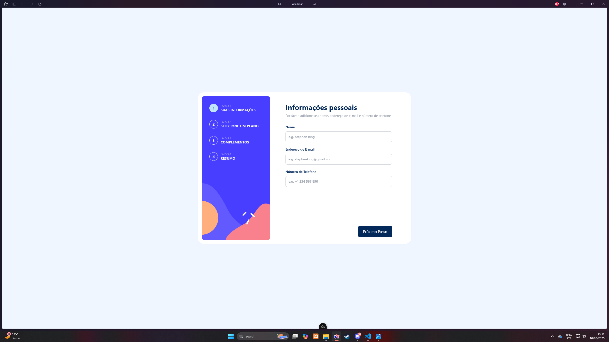
  

  

    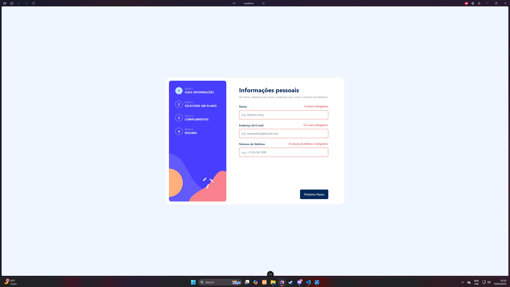
  

  

    
  

  

    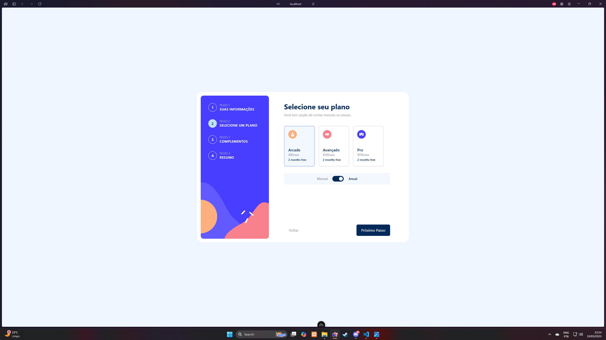
  

  

    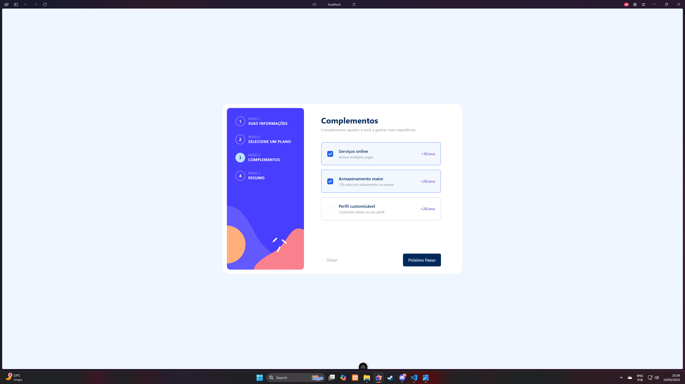
  

  

    
  

  

    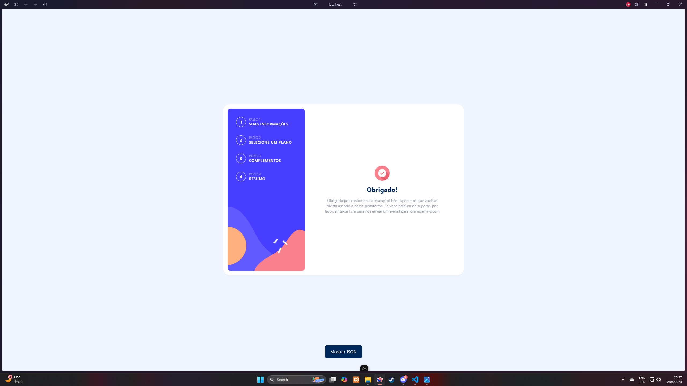
  

  

    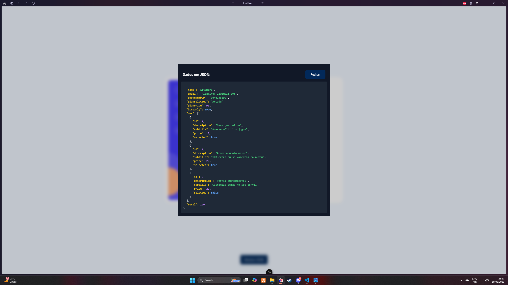
  

  

### 📱 Prints da Tela - Mobile

  

    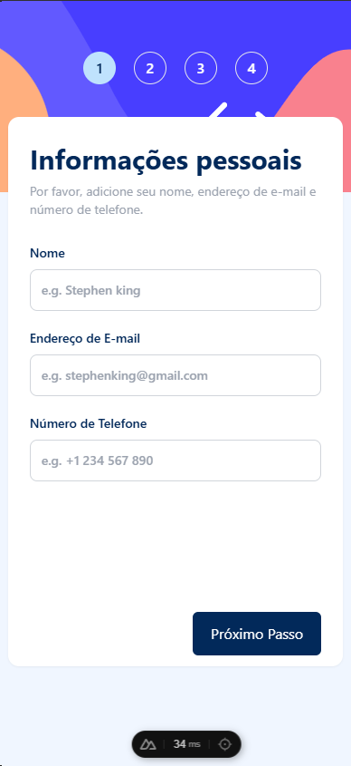
  

  

    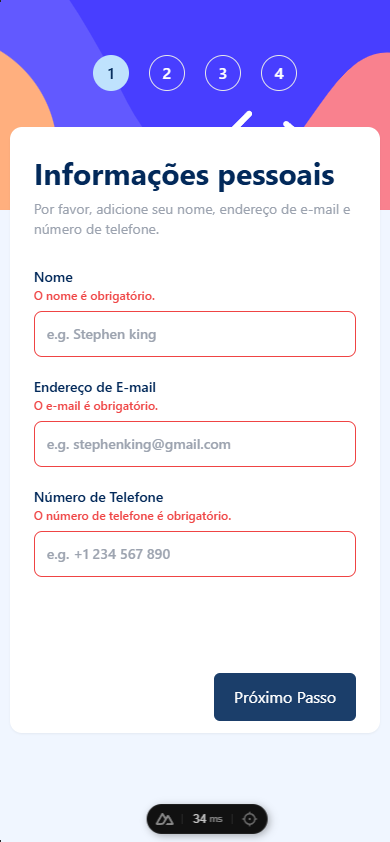
  

  

    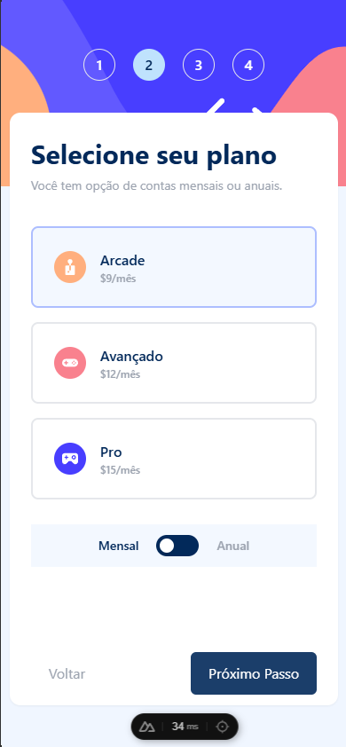
  

  

    
  

  

    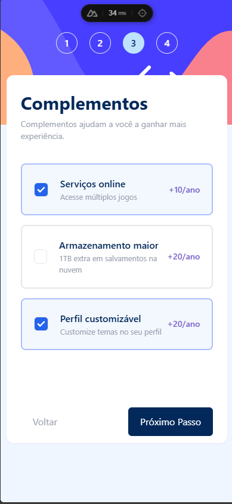
  

  

    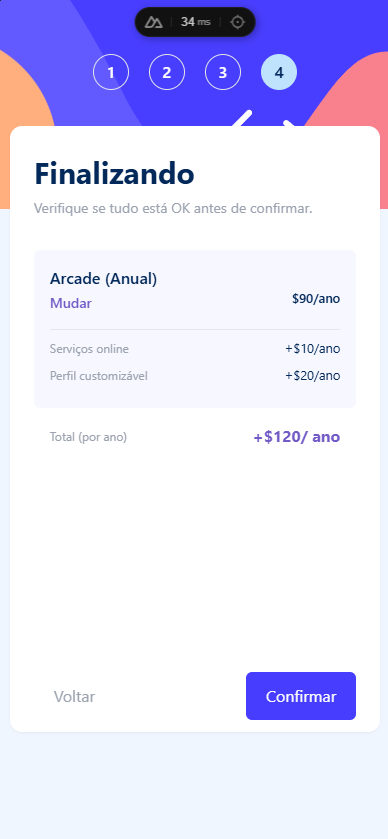
  

  

    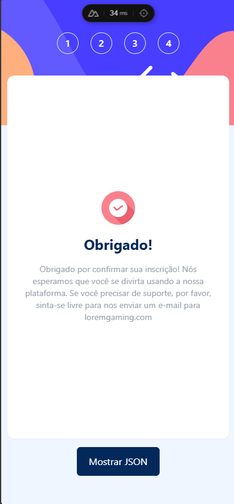
  

  

    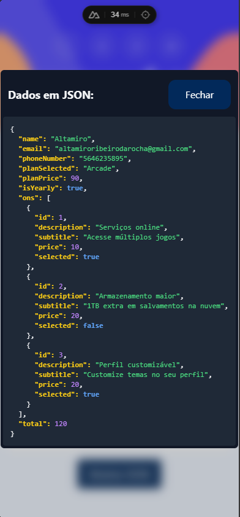
  

## ⚙️ Tecnologias Utilizadas

- Vue.js 3 + Vite
- Nuxt 3.15.4
- Tailwind CSS
- Componentes reutilizáveis
- Formulários reativos

---
